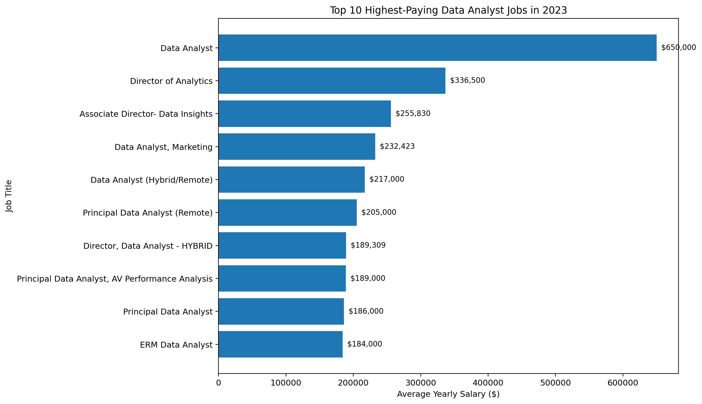
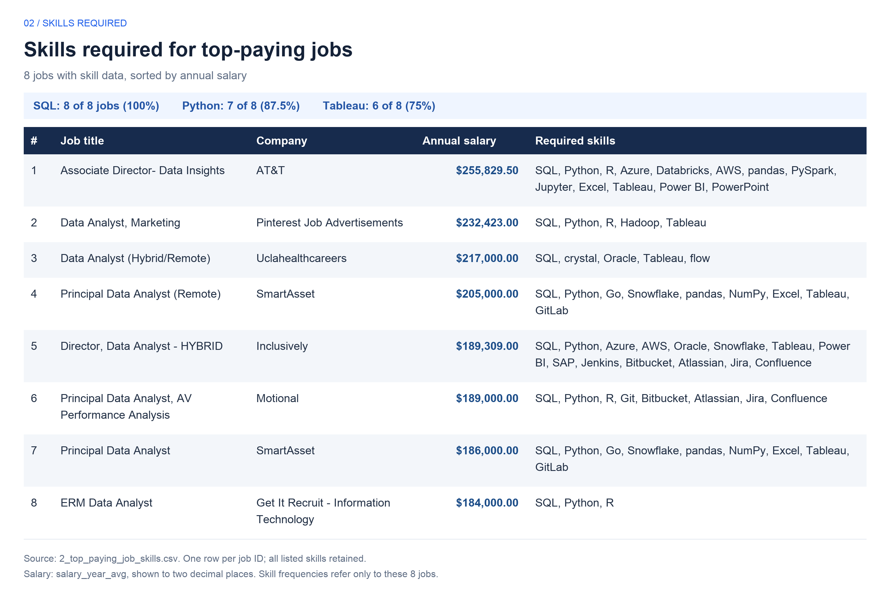
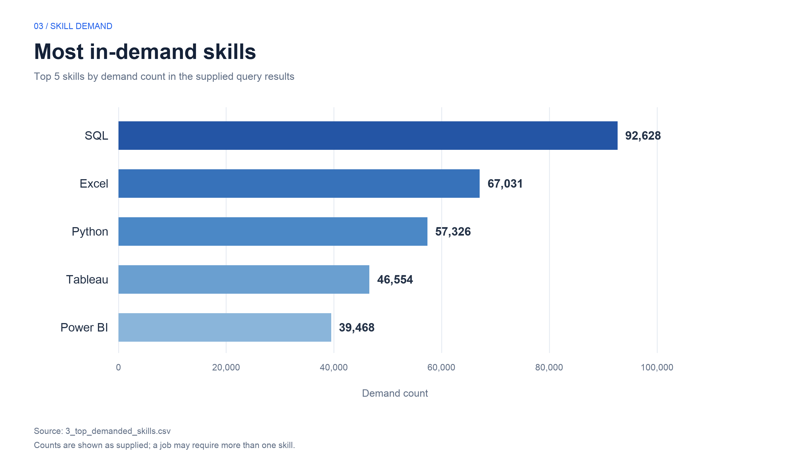
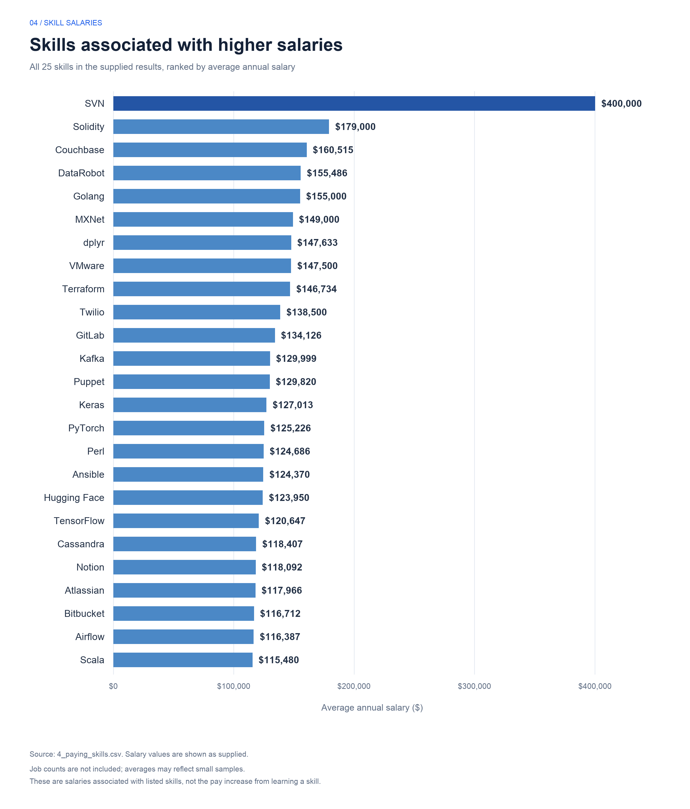
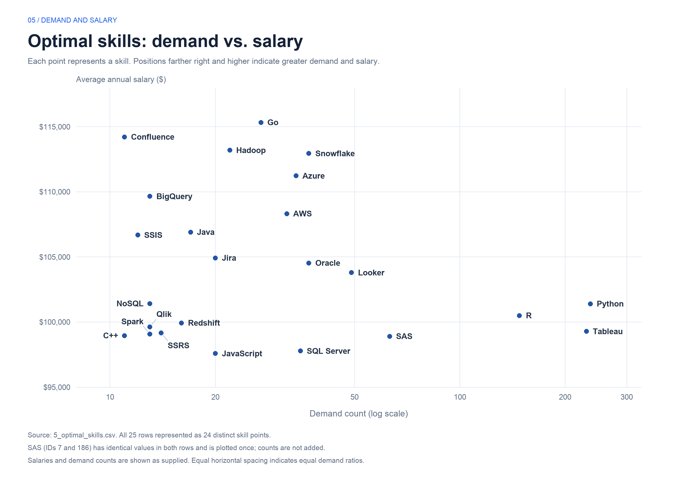

# Introduction
📊 Dive into the data job market! Focusing on data analyst roles, this project explores 💰 top-paying jobs, 🔥 in-demand skills, and 📈 where high demand meets high salary in data analytics.

💡

🔍 SQL queries? Check them out here: [project_sql folder](/project_sql/)

# Background
Driven by a quest to navigate the data analyst job market more effectively, this project was born from a desire to pinpoint top-paid and in-demand skills, streamlining others work to find optimal jobs.

Data hails from my [SQL Course](https://lukebarousse.com/sql). It's packed with insights on job titles, salaries, locations, and essential skills.


### The questions I wanted to answer through my SQL queries were:

1. What are the top-paying data analyst jobs?
2. What skills are required for these top-paying jobs?
3. What skills are most in demand for data analysts?
4. Which skills are associated with higher salaries?
5. What are the most optimal skills to learn?

# Tools I Used
For my deep dive into the data analyst job market, I harnessed the power of several key tools:

- **SQL:** The backbone of my analysis, allowing me to query the database and unearth critical insights.
- **PostgreSQL:** The chosen database management system, ideal for handling the job posting data.
- **Visual Studio Code:** My go-to for database management and executing SQL queries.
- **Git & GitHub:** Essential for version control and sharing my SQL scripts and analysis, ensuring collaboration and project tracking.


# The Analysis
Each query for this project aimed at investigating specific aspects of the data analyst job market. Here's how I approached each question:

###  1. Top Paying Data Analyst Jobs

To identify the highest-paying roles, I filtered data analyst positions by average yearly salary and location, focusing on remote jobs. This query highlights the high paying opportunities in the field.

```sql
SELECT
    job_id,
    job_title,
    job_location,
    job_schedule_type,
    salary_year_avg,
    job_posted_date,
    name AS company_name
FROM
    job_postings_fact
LEFT JOIN company_dim ON job_postings_fact.company_id = company_dim.company_id
WHERE
    job_title_short = 'Data Analyst' AND
    job_location = 'Anywhere' AND
    salary_year_avg IS NOT NULL
ORDER BY
    salary_year_avg DESC
LIMIT 10;
```
Here's the breakdown of the top data analyst jobs in 2023:

- **Wide Salary Range:** Top 10 paying data analyst roles span from $184,000 to $650,000, indicating significant salary potential in the field.
- **Diverse Employers:** Companies like SmartAsset, Meta, and AT&T are among those offering high salaries, showing a broad interest across different industries.
- **Job Title Variety:** There's a high diversity in job titles, from Data Analyst to Director of Analytics, reflecting varied roles and specialization within data analytics.


*Bar graph visualizing the salaries for the top 10 highest-paying data analyst roles; ChatGPT generated this graph from my SQL query results.*

### 2. Skills for Top Paying Jobs
Here's a breakdown of the skills required for the top-paying Data Analyst jobs:
```sql
WITH top_paying_jobs AS (
    SELECT
        job_id,
        job_title,
        salary_year_avg,
        name AS company_name
    FROM
        job_postings_fact
    LEFT JOIN company_dim
        ON job_postings_fact.company_id = company_dim.company_id
    WHERE
        job_title_short = 'Data Analyst' AND
        job_location = 'Anywhere' AND
        salary_year_avg IS NOT NULL
    ORDER BY
        salary_year_avg DESC
    LIMIT 10
)

SELECT
    top_paying_jobs.*,
    skills
FROM top_paying_jobs
INNER JOIN skills_job_dim
    ON top_paying_jobs.job_id = skills_job_dim.job_id
INNER JOIN skills_dim
    ON skills_job_dim.skill_id = skills_dim.skill_id
ORDER BY
    salary_year_avg DESC;
```
Here's the breakdown of the most demanded skills for the top-paying Data Analyst jobs:

- **SQL Leads the Way:** SQL is the most frequently required skill, appearing in 8 of the top-paying job postings, showing its importance for high-paying Data Analyst roles.
- **Python and Tableau Are Key:** Python appears in 7 postings and Tableau in 6, highlighting the strong demand for programming and data visualization skills.
- **Broad Technical Skill Set:** Other skills such as R, Snowflake, Pandas, and Excel also appear, showing that high-paying Data Analyst roles often require a diverse combination of analytical and technical tools.



*Bar graph visualizing the most common skills required for the top-paying Data Analyst jobs.*

### 3. In-Demand Skills for Data Analysts
This query helped identify the skills most frequently requested in Data Analyst job postings, highlighting the skills that are currently in the highest demand.

```sql
SELECT
    skills,
    COUNT(skills_job_dim.job_id) AS demand_count
FROM job_postings_fact
INNER JOIN skills_job_dim
    ON job_postings_fact.job_id = skills_job_dim.job_id
INNER JOIN skills_dim
    ON skills_job_dim.skill_id = skills_dim.skill_id
WHERE
    job_title_short = 'Data Analyst'
GROUP BY
    skills
ORDER BY
    demand_count DESC
LIMIT 5;
```
Here's the breakdown of the most in-demand skills for Data Analysts:

SQL Leads the Market: SQL is the most demanded skill, with 7,291 job postings, showing its importance as a core skill for Data Analysts.

Excel Remains Essential: Excel ranks second with 4,611 job postings, demonstrating that spreadsheet skills are still widely required.

Programming and Visualization Are Important: Python, Tableau, and Power BI are also highly demanded, highlighting the importance of programming, data visualization, and business intelligence skills.

Bar graph visualizing the top 5 most in-demand skills for Data Analyst roles.

### 4. Skills Based on Salary
This query compares the average salaries associated with different skills, helping identify which skills are linked to higher-paying Data Analyst roles.

```sql
SELECT
    skills,
    ROUND(AVG(salary_year_avg), 0) AS avg_salary
FROM job_postings_fact
INNER JOIN skills_job_dim
    ON job_postings_fact.job_id = skills_job_dim.job_id
INNER JOIN skills_dim
    ON skills_job_dim.skill_id = skills_dim.skill_id
WHERE
    job_title_short = 'Data Analyst'
    AND salary_year_avg IS NOT NULL
GROUP BY
    skills
ORDER BY
    avg_salary DESC
LIMIT 25; 
```
Here's the breakdown of the highest-paying skills for Data Analysts:

Specialized Technical Skills Pay More: Skills such as PySpark, Bitbucket, and Couchbase are associated with some of the highest average salaries.

Cloud and Data Engineering Skills Are Valuable: Technologies related to cloud platforms, databases, and large-scale data processing tend to offer higher salary potential.

Higher Salaries Often Come with Specialized Skills: Less common and more advanced technical skills can command higher salaries because they are harder to find in the job market.

Bar graph visualizing the highest-paying skills for Data Analyst roles based on average salary.

### 5. Most Optimal Skills to Learn

This query identifies skills that offer the best combination of high demand and high average salary, helping determine which skills are most valuable for Data Analysts to learn.

```sqlWITH skills_demand AS (
    SELECT
        skills_dim.skill_id,
        skills_dim.skills,
        COUNT(skills_job_dim.job_id) AS demand_count
    FROM job_postings_fact
    INNER JOIN skills_job_dim
        ON job_postings_fact.job_id = skills_job_dim.job_id
    INNER JOIN skills_dim
        ON skills_job_dim.skill_id = skills_dim.skill_id
    WHERE
        job_title_short = 'Data Analyst'
        AND salary_year_avg IS NOT NULL
        AND job_work_from_home = True
    GROUP BY
        skills_dim.skill_id
),

average_salary AS (
    SELECT
        skills_job_dim.skill_id,
        ROUND(AVG(job_postings_fact.salary_year_avg), 0) AS avg_salary
    FROM job_postings_fact
    INNER JOIN skills_job_dim
        ON job_postings_fact.job_id = skills_job_dim.job_id
    INNER JOIN skills_dim
        ON skills_job_dim.skill_id = skills_dim.skill_id
    WHERE
        job_title_short = 'Data Analyst'
        AND salary_year_avg IS NOT NULL
        AND job_work_from_home = True
    GROUP BY
        skills_job_dim.skill_id
)

SELECT
    skills_demand.skill_id,
    skills_demand.skills,
    demand_count,
    avg_salary
FROM
    skills_demand
INNER JOIN average_salary
    ON skills_demand.skill_id = average_salary.skill_id
WHERE
    demand_count > 10
ORDER BY
    avg_salary DESC,
    demand_count DESC
LIMIT 25;


-- rewriting this same query more concisely

SELECT
    skills_dim.skill_id,
    skills_dim.skills,
    COUNT(skills_job_dim.job_id) AS demand_count,
    ROUND(AVG(job_postings_fact.salary_year_avg), 0) AS avg_salary
FROM job_postings_fact
INNER JOIN skills_job_dim
    ON job_postings_fact.job_id = skills_job_dim.job_id
INNER JOIN skills_dim
    ON skills_job_dim.skill_id = skills_dim.skill_id
WHERE
    job_title_short = 'Data Analyst'
    AND salary_year_avg IS NOT NULL
    AND job_work_from_home = True
GROUP BY
    skills_dim.skill_id
HAVING
    COUNT(skills_job_dim.job_id) > 10
ORDER BY
    avg_salary DESC,
    demand_count DESC
LIMIT 25;
```
Here's the breakdown of the most optimal skills for Data Analysts to learn:

High Demand and High Salary: The most valuable skills are those that combine strong market demand with above-average salaries.

Technical Skills Offer Strong Opportunities: Programming, database, cloud, and data engineering tools tend to provide a strong balance between demand and earning potential.

Demand Matters Alongside Salary: A skill with a very high salary but very few job postings may be less practical than one that offers both strong demand and competitive pay.


Visualization comparing demand and average salary to identify the most optimal skills for Data Analysts to learn.

   

   
# What I Learned
Throughout this project, I strengthened my SQL toolkit and became more confident using it to solve real-world analytical problems:

- **🧩 Complex Query Building**: Improved my ability to work with multiple tables, structure more advanced queries, and use JOINs, CTEs, and subqueries to solve multi-step analytical problems.

- **📊 Data Aggregation and Analysis**: Became more comfortable summarizing large datasets, comparing salaries and skill demand, and using aggregation to uncover meaningful patterns in the job market.

- 🔎 **Filtering and Data Exploration**: Developed a better understanding of how to refine datasets using different conditions and explore specific segments such as remote roles, salary ranges, and in-demand skills.

- **💡 Analytical Problem Solving**: Strengthened my ability to translate business questions into SQL queries, interpret the results, and turn raw data into clear and actionable insights.

- 📈 **Communicating Insights**: Learned how to present query results through visualisations and a structured GitHub README, making the analysis easier to understand and more useful as a portfolio project.
# Conclusions
### Insights
# Conclusions

### Insights

1. **Top-Paying Data Analyst Jobs:** The highest-paying remote Data Analyst roles show a wide salary range, highlighting the strong earning potential available across different companies and specialized positions.

2. **Skills for Top-Paying Jobs:** High-paying Data Analyst roles frequently require skills such as SQL, Python, and Tableau, showing that a strong combination of querying, programming, and visualization skills is valuable for higher-paying positions.

3. **Most In-Demand Skills:** SQL remains one of the most in-demand skills for Data Analysts, while Excel, Python, Tableau, and Power BI also play an important role in the job market.

4. **Skills with Higher Salaries:** More specialized technical skills are often associated with higher average salaries, suggesting that niche expertise can increase earning potential.

5. **Optimal Skills for Job Market Value:** The most valuable skills are those that combine strong demand with competitive salaries, making them especially useful for Data Analysts who want to improve both employability and earning potential.

### Closing Thoughts

This project strengthened my SQL skills and gave me a clearer understanding of the Data Analyst job market. By analysing salaries, skill demand, and job requirements, I learned how SQL can be used not only to query data, but also to answer practical business questions and uncover meaningful insights. The project also highlighted the importance of developing skills that balance strong market demand with salary potential. Moving forward, I plan to continue building my analytical skills and applying SQL to more real-world datasets and projects.